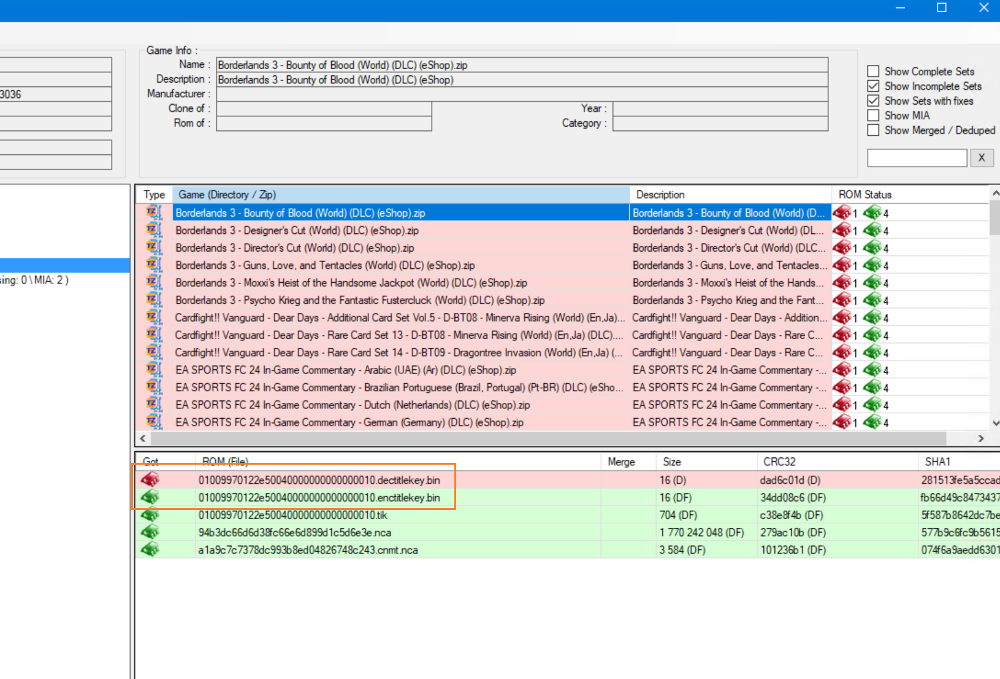

# GenerateSwitchDecTitleKey

You can use this program to generate switch dectitlekey.bin from enctitlekey.bin + nca.
Just drag a zip-file contaning a large nca and enctitlekey.bin to the executable.

The generated dec-files will be placed in the same directory as the executable.

This would probably have been much simpler to write in PowerShell using hactoolnet.

## About

This is using [LibHac](https://github.com/Thealexbarney/LibHac) to read switch-files.
